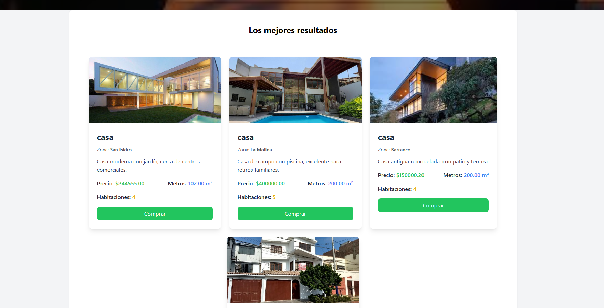

# Proyecto Inmobiliaria - Consulta Inmobiliaria

Este proyecto permite realizar consultas en lenguaje natural sobre la base de datos de viviendas. Las consultas se procesan usando un backend en **Django** y se presentan en una interfaz de usuario construida con **Vue.js**.

## Tecnologías Utilizadas


- **Backend**: Django, Python
- **Frontend**: Vue.js, Tailwind CSS
- **Base de Datos**: MySQL
- **Almacenamiento de Imágenes**: Cloudinary

## Estructura del Proyecto

El proyecto está organizado en dos carpetas principales:

1. **`backend/`**: Contiene la lógica del servidor y la API RESTful.
    - El archivo principal de ejecución es `backend/inmobiliaria/manage.py`.
    - Los controladores y vistas están en `backend/inmobiliaria/views.py`.

2. **`frontend/`**: Contiene la interfaz de usuario que interactúa con la API.
    - Las imágenes del proyecto deben colocarse en la carpeta `frontend/img/`, con los nombres `1.png` y `2.png`.
    - El proyecto Vue.js se encuentra en `frontend/inmobiliaria/`.

### Rutas Importantes

- **Backend**: `backend/inmobiliaria/`
  - El archivo principal `manage.py` se encuentra en `backend/inmobiliaria/manage.py`.
  - Para ejecutar el servidor del backend, navega a la carpeta `backend/inmobiliaria/` y ejecuta el siguiente comando:
    ```bash
    cd backend/inmobiliaria
    python manage.py runserver
    ```

- **Frontend**: `frontend/inmobiliaria/`
  - El proyecto Vue.js se encuentra en `frontend/inmobiliaria/`.
  - Para instalar las dependencias de **npm** y ejecutar el servidor del frontend, navega a la carpeta `frontend/inmobiliaria/` y ejecuta los siguientes comandos:
    ```bash
    cd frontend/inmobiliaria
    npm install
    npm run serve
    ```

## Imágenes del Proyecto


Ejemplo de inclusión de imágenes:

```html




